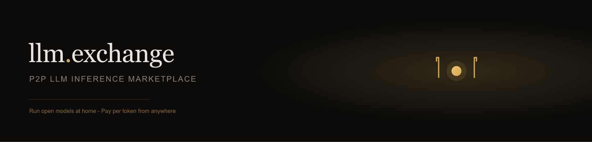

<p align="center">
  
</p>

# llm.exchange agent

**Publish your GPU to the marketplace.**

[Platform](https://github.com/guhcostan/llm-exchange-platform) · [CLI docs](https://github.com/guhcostan/llm-exchange-platform/blob/main/docs/cli.md) · [Protocol](https://github.com/guhcostan/llm-exchange-contracts)

---

## What is this?

The **llm.exchange provider agent** connects your local **Ollama** or **vLLM** runtime to the marketplace over WebSocket. Consumers call the platform API; your GPU serves inference; you earn per token.

Use the **`llmex` CLI** for device login and one-command publishing — no manual token copy required.

---

## Why this agent?

- **Device login** — `llmex login` approves via browser, saves credentials locally
- **Auto-detect Ollama** — tries `:11434` and `:11435` (Docker compose)
- **Open models** — register any model your runtime exposes
- **Legacy YAML** — `config.yaml` + `cmd/agent` still supported

---

## ⚡ Quick Start

```bash
git clone git@github.com:guhcostan/llm-exchange-agent.git
cd llm-exchange-agent
export LLMEX_API_URL=http://localhost:8080   # platform API

go run ./cmd/llmex login    # browser approval → saves ~/.config/llmex/credentials.json
go run ./cmd/llmex serve    # detect Ollama, connect WebSocket
```

> Platform must be running. See [setup guide](https://github.com/guhcostan/llm-exchange-platform/blob/main/docs/setup.md).

---

## Core commands

| Command | Description |
|---------|-------------|
| `llmex login` | Device authorization flow (browser) |
| `llmex serve` | Connect to platform, publish models |
| `llmex status` | Show credentials + Ollama detection |
| `llmex logout` | Remove local credentials |

Build from source:

```bash
go build -o bin/llmex ./cmd/llmex
```

---

## Legacy config (YAML)

```bash
cp config.example.yaml config.yaml
# Set provider_token from dashboard (ptok_...)
go run ./cmd/agent
```

```yaml
platform_url: ws://localhost:8080/ws/agent
provider_token: ptok_FROM_DASHBOARD
runtime: ollama
runtime_url: http://localhost:11435
models:
  - id: llama3.1:8b
    price_input_per_million: 0.50
    price_output_per_million: 0.80
```

<details>
<summary>Environment variables</summary>

| Variable | Default | Description |
|----------|---------|-------------|
| `LLMEX_API_URL` | `https://api.llm.exchange` | REST API base |
| `LLMEX_PLATFORM_URL` | derived from API URL | WebSocket endpoint |

</details>

---

## FAQ

**Which Ollama port?**  
Native Ollama uses `:11434`. Docker Compose in the platform repo uses `:11435`. `llmex serve` tries both.

**Do I need the dashboard token?**  
Not with `llmex login`. YAML mode still uses `ptok_` from the dashboard.

**Where is the protocol defined?**  
[llm-exchange-contracts](https://github.com/guhcostan/llm-exchange-contracts) — OpenAPI + WebSocket schemas.

---

## License

MIT
